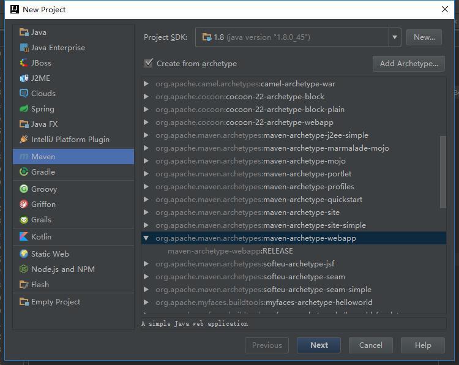
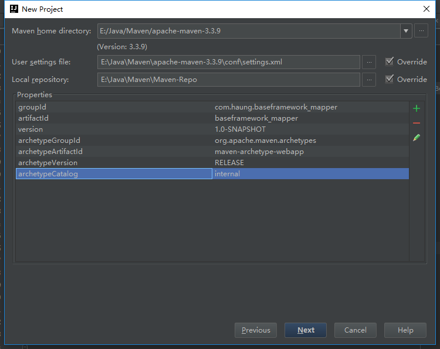

新建项目的时候选择maven项目。
<!-- more -->

接着下一步，这里需要注在Properties中添加一个参数`archetypeCatalog=internal`，不加这个参数，在maven生成骨架的时候将会非常慢，有时候直接卡住。
>>来自网上的解释：
>>*archetypeCatalog*表示插件使用的archetype元数据，不加这个参数时默认为remote，local，即中央仓库archetype元数据，由于中央仓库的archetype太多了所以导致很慢，指定internal来表示仅使用内部元数据。

这样，在初始化maven项目的时候就不会被卡住了。
